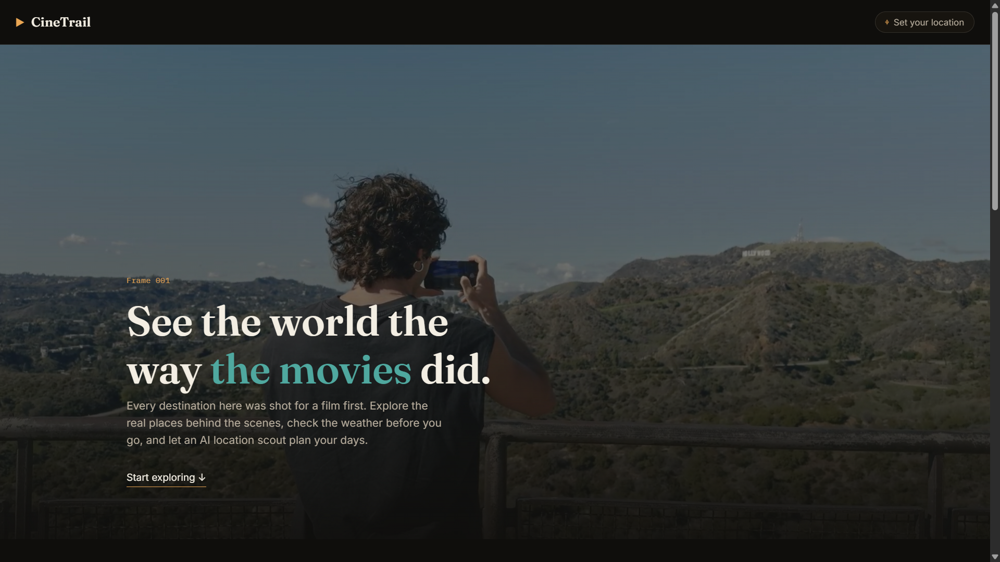
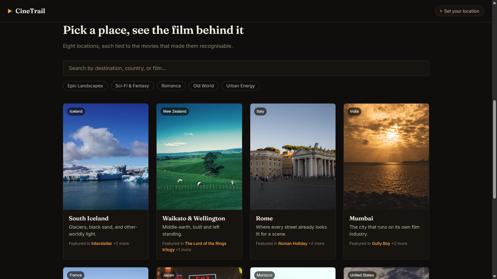
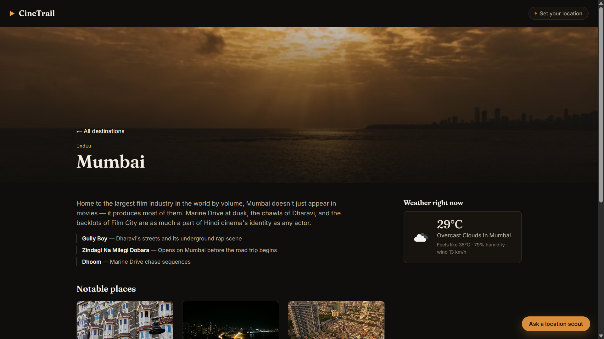

# CineTrail

A travel exploration app built around a simple idea: **every destination
here was a filming location first.** Browse the world through the movies
shot in it, check live weather before you go, and let an AI "location
scout" plan your days.

Built for the Design Esthetics front-end assignment.

## Features

- **Cinematic hero** — full-bleed looping video, title-card-style headline.
- **Destination explorer** — search by destination, country, or film title;
  filter by mood (Epic Landscapes, Romance, Urban Energy, Sci-Fi & Fantasy,
  Old World).
- **Destination detail pages** — description, the films connected to the
  place, live weather, and a set of "notable places" — each with its own
  photo and blurb, not a bare list.
- **Location awareness** — a "use my location" button (browser Geolocation
  API) plus a manual city search that falls back gracefully if the visitor
  declines to share their location.
- **Live weather** via the OpenWeather API.
- **Live images** via the Pexels API — no image files are bundled in the
  repo; every photo is fetched at runtime.
- **AI location scout** — a chat widget (Google Gemini) for asking
  questions about a destination.
- **AI itinerary planner** — generates a day-by-day plan and renders it as
  a real schedule (styled like a film shooting schedule, with monospace
  "timecode" day markers) instead of a block of chat text.
- Deliberate loading / empty / error states throughout — nothing just
  breaks silently.
- Responsive from phone to desktop; visible keyboard focus states;
  semantic HTML landmarks (`header`, `main`, `footer`, `aside`).

## APIs used

| Purpose         | Provider    | Docs |
|------------------|-------------|------|
| Weather + geocoding | OpenWeather | https://openweathermap.org/api |
| Images           | Pexels      | https://www.pexels.com/api/ |
| AI chat + itinerary | Google Gemini | https://ai.google.dev/ |

All three are free-tier services. None of the keys are committed to this
repository — see below.

## Running it locally

1. **Install dependencies**
   ```bash
   npm install
   ```

2. **Get your API keys** (all free):
   - OpenWeather: https://home.openweathermap.org/users/sign_up — copy your
     default API key from the "API keys" tab.
   - Pexels: https://www.pexels.com/api/ — sign up and copy your API key.
   - Gemini: https://aistudio.google.com/apikey — create a key.

3. **Set up your environment file**
   ```bash
   cp .env.example .env
   ```
   Then open `.env` and paste your three keys in. `.env` is already listed
   in `.gitignore`, so it will never be committed.

4. **Add a hero video** — this sandbox couldn't fetch one for you (see the
   note in `src/components/Hero.jsx`). Download a short, silent, landscape
   clip from [Mixkit](https://mixkit.co/free-stock-video/) or
   [Coverr](https://coverr.co) and save it as `public/hero.mp4`. If you
   skip this, the hero still works — it just shows a plain gradient
   instead of the video, since that failure state is handled on purpose.

5. **Run the dev server**
   ```bash
   npm run dev
   ```
   Open the printed local URL (usually `http://localhost:5173`).

6. **Build for production**
   ```bash
   npm run build
   ```
   This outputs a static site to `dist/`, which you can deploy to Vercel,
   Netlify, or GitHub Pages. Remember to add the same three environment
   variables in your host's dashboard (not in the repo).

## Project structure

```
src/
  data/destinations.js     curated destination + film + place data
  lib/
    weather.js              OpenWeather API calls
    images.js               Pexels API calls + simple in-memory cache
    gemini.js               Google Gemini chat + itinerary generation
  context/LocationContext.jsx   shared "visitor's location" state
  components/               all reusable UI pieces
  pages/
    Home.jsx                 hero + searchable/filterable explorer
    DestinationDetail.jsx     weather, places, chatbot, itinerary
```

## Design notes

The palette is built around film colour grading — a warm, dark
"screening room" background with the classic teal/orange grading pair as
the two accents (teal for structure, orange for emphasis). Day markers in
the generated itinerary use a monospace face, the way an editing
timeline actually displays timecodes — a deliberate reference, not a
decorative default.

## Screenshots

<br><br><br>
<br><br><br>

